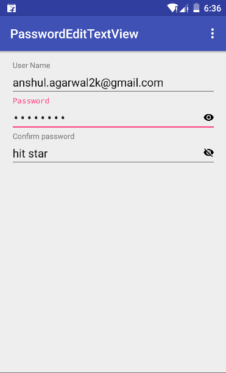

# PasswordEditText
Custom EditTextView to show/hide password with customizable icon.



# How to use


```groovy

 <in.anshul.libray.PasswordEditText
            android:layout_width="match_parent"
            android:layout_height="wrap_content"
            app:hide_drawable="@drawable/hide_password"
            app:password_visible="true"
            android:hint="Confirm password"
            app:show_drawable="@drawable/show_password" />
```
  Instead of drawable you can also use Text
```groovy        
            

 <in.anshul.libray.PasswordEditText
            ...
            app:show_as_text="true"
            app:show_text="@string/show_text"
            app:hide_text="@string/hide_text"/>
 ```
# Customise
 
 * `app:show_drawable="@drawable/show_password"` 
 * `app:hide_drawable="@drawable/hide_password"`
 
Defualt Password Visiblity can be set using attr 
* `app:password_visible="true"`


[](https://jitpack.io/#anshulagarwal06/PasswordEditText)


# Download

Include `jitpack.io` inside of **root** project `build.gradle`:

```groovy
allprojects {
		repositories {
			...
			maven { url "https://jitpack.io" }
		}
	}
```

After that you can easily include the library in your **app** `build.gradle`:

```groovy
dependencies {
	        compile 'com.github.anshulagarwal06:PasswordEditText:v1.0'
	}
```

That's it build your project.
